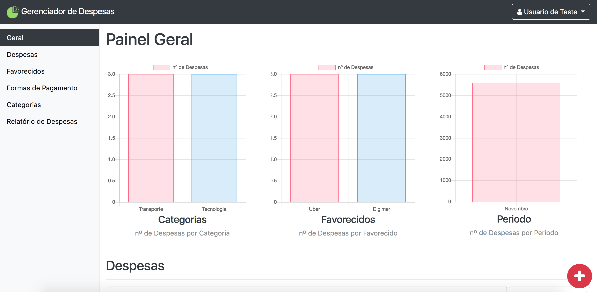

# Gerenciador de Despesas

Uma aplicação web com o objetivo de monitorar despesas e realizar o mapeamento dos gastos efetuados.

## Ambiente de Desenvolvimento

* [XAMPP](https://www.apachefriends.org/pt_br/index.html) -  Ambiente de desenvolvimento PHP 

## Ambiente de Produção

* Qualquer ambiente com suporte a PHP 5.6 ou superior e MySQL 5.5 ou superior.

## Tecnologias Utilizadas

* [CodeIgniter](https://www.codeigniter.com/) - Framework PHP para a criação de aplicacões web completas.
* [Jquery](https://jquery.com/) - Framework Javascript para a manipulação de eventos e animações em aplicações web.
* [ChartJS](http://www.chartjs.org/) - Pacote de componentes graficos e scripts para a geração de graficos.  
* [Bootstrap](http://getbootstrap.com/) - Pacote de componentes HTML, CSS e Javascript para o desenvolvimento Web.
* [FontAwesome](http://fontawesome.io/) - Pacote de icones HTML, CSS e Javascript para paginas web.

## Autor

* **[Eduardo Varela](https://github.com/eduvarela)**
